\# NeverLate - C4 Component Diagram

\## Purpose

Define the main internal components of the NeverLate Flutter mobile application.

\---

\## Component Diagram

```mermaid

flowchart TD



User\[Mobile User]



App\[Flutter Mobile App]



AuthUI\[Authentication UI]

HomeUI\[Home Dashboard UI]

ReminderUI\[Reminder Management UI]

DocumentUI\[Document Management UI]

ChecklistUI\[Checklist UI]

CalendarUI\[Calendar UI]

StatsUI\[Statistics UI]

ProfileUI\[Profile UI]



AuthService\[Auth Service]

ReminderService\[Reminder Service]

DocumentService\[Document Service]

ChecklistService\[Checklist Service]

NotificationService\[Notification Service]

AnalyticsService\[Analytics Service]



FirebaseAuth\[Firebase Authentication]

Firestore\[Cloud Firestore]

Storage\[Firebase Storage]

FCM\[Firebase Cloud Messaging]

FirebaseAnalytics\[Firebase Analytics]



User --> App



App --> AuthUI

App --> HomeUI

App --> ReminderUI

App --> DocumentUI

App --> ChecklistUI

App --> CalendarUI

App --> StatsUI

App --> ProfileUI



AuthUI --> AuthService

ReminderUI --> ReminderService

DocumentUI --> DocumentService

ChecklistUI --> ChecklistService

CalendarUI --> ReminderService

StatsUI --> AnalyticsService

ProfileUI --> AuthService



AuthService --> FirebaseAuth

ReminderService --> Firestore

DocumentService --> Storage

DocumentService --> Firestore

ChecklistService --> Firestore

NotificationService --> FCM

AnalyticsService --> FirebaseAnalytics

```

\---

\## Mobile App Components

| Component | Responsibility |

|---|---|

| Authentication UI | Login, register, forgot password |

| Home Dashboard UI | Upcoming reminders and summary |

| Reminder Management UI | Create, edit, delete and complete reminders |

| Document Management UI | Upload, preview and remove files |

| Checklist UI | Manage required items |

| Calendar UI | Display reminders by date |

| Statistics UI | Show completed, pending and overdue reminders |

| Profile UI | User profile and preferences |

\---

\## Service Components

| Service | Responsibility |

|---|---|

| Auth Service | Handles authentication logic |

| Reminder Service | Handles reminder data operations |

| Document Service | Handles file uploads and metadata |

| Checklist Service | Handles checklist operations |

| Notification Service | Handles notification registration and delivery |

| Analytics Service | Handles usage and event tracking |

