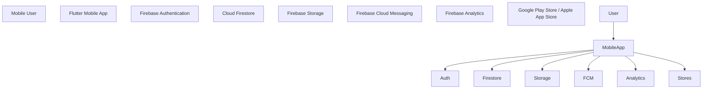

\# NeverLate - C4 Container Diagram

\## Purpose

Define the main technical containers that make up the NeverLate MVP.

\---

\## Container Diagram

\---

\## Containers

| Container | Technology | Responsibility |

|---|---|---|

| Mobile App | Flutter | User interface and mobile experience |

| Authentication | Firebase Auth | User registration and login |

| Database | Cloud Firestore | Store reminders, users, checklists, and metadata |

| Storage | Firebase Storage | Store user uploaded files |

| Notifications | Firebase Cloud Messaging | Send push notifications |

| Analytics | Firebase Analytics | Track basic app usage |

| App Distribution | Google Play / App Store | Publish Android and iOS apps |

\---

\## Notes

The MVP will use managed Firebase services to reduce backend complexity and accelerate delivery.

