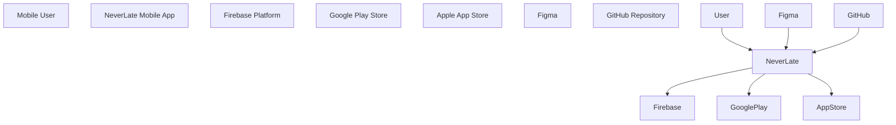

\# NeverLate - C4 Context Diagram

\## Purpose

Define the system context for NeverLate using the C4 model.

\---

\## System Context

\---

\## External Systems

| System | Purpose |

|---|---|

| Firebase Platform | Authentication, database, storage, notifications, analytics |

| Google Play Store | Android app distribution |

| Apple App Store | iOS app distribution |

| Figma | UX/UI design and prototype |

| GitHub | Source control and documentation |

\---

\## Users

| User | Description |

|---|---|

| Mobile User | Person using NeverLate to manage reminders, documents, and checklists |

| Client | Bladimir Navarro, business owner and product stakeholder |

| Developer / Architect | Responsible for product architecture, implementation, and delivery |

