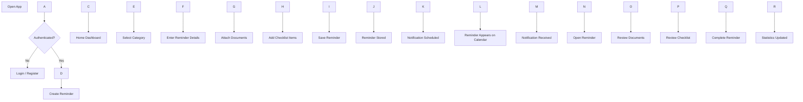

\# NeverLate - User Flow

\## Purpose

Define the primary user journey through the NeverLate MVP.

\---

\## Main User Flow

\---

\## Happy Path

1\. User logs in.

2\. User creates a reminder.

3\. User uploads documents.

4\. User creates a checklist.

5\. Reminder is saved.

6\. Notification is scheduled.

7\. User receives notification.

8\. User reviews required items.

9\. User completes the reminder.

10\. Statistics are updated.

\---

\## Future User Flows

\- Family shared reminders

\- Recurring reminders

\- AI-generated checklist

\- Calendar synchronization

\- Voice reminders

\- Smart suggestions

